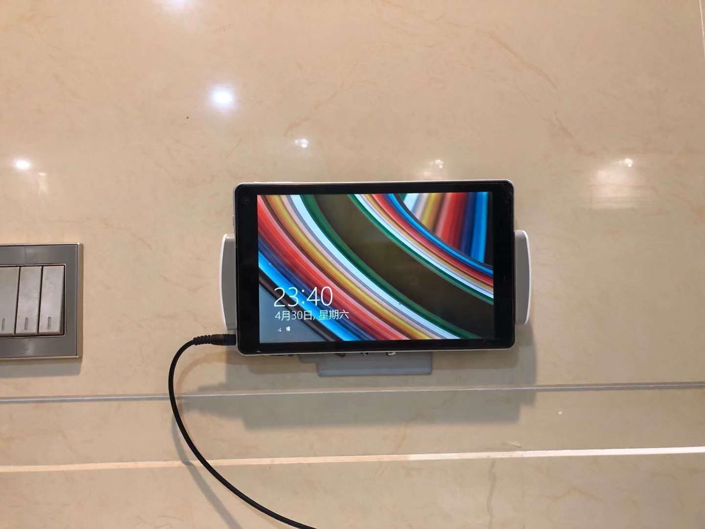
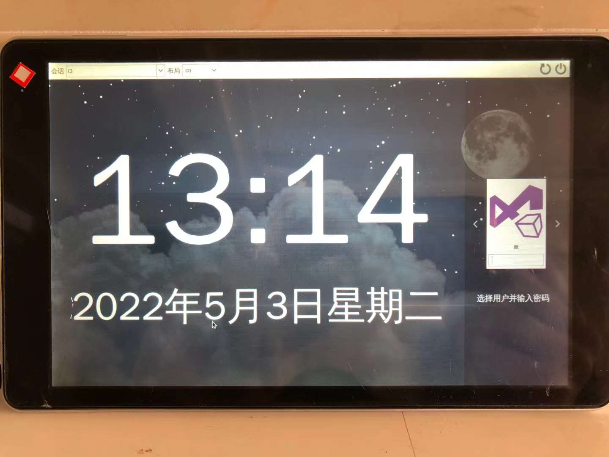
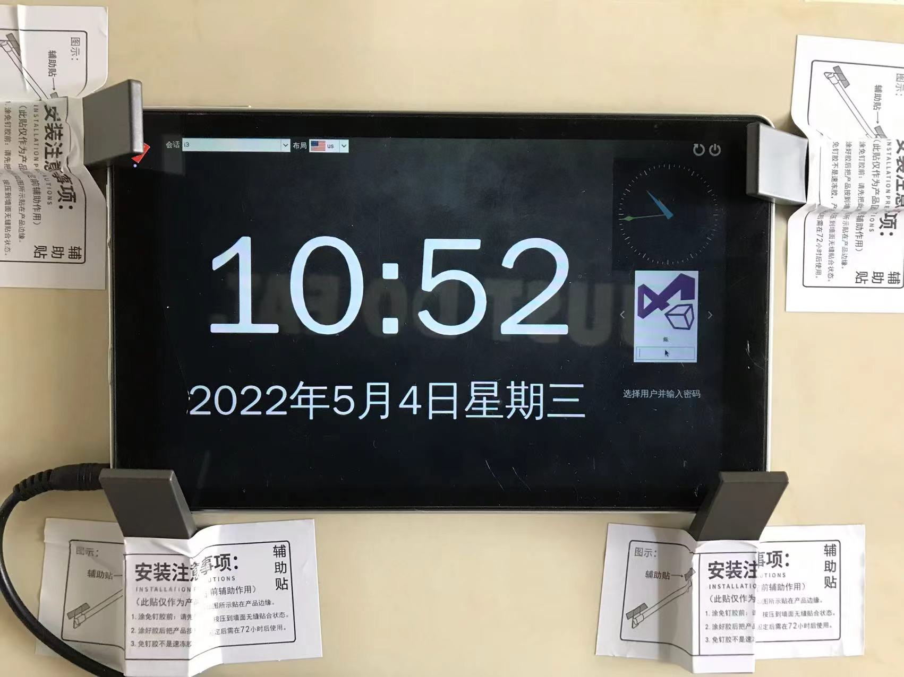

# A SDDM Theme for Tablet Acts as a Clock

[简体中文](README.zh-CN.md) | English

## User Story

I have a Cube iWork 8 Windows 8 tablet, and I want it to be a clock and downloader.



So I installed Debian 11 on it, and made this theme.



With XClock run on it:



## Install

```sh
git clone https://github.com/UMU618/sddm-theme-clock
cd sddm-theme-clock
sudo ./install.sh
```

## About

It's base on [sddm-theme-maui](https://github.com/sddm/sddm).
