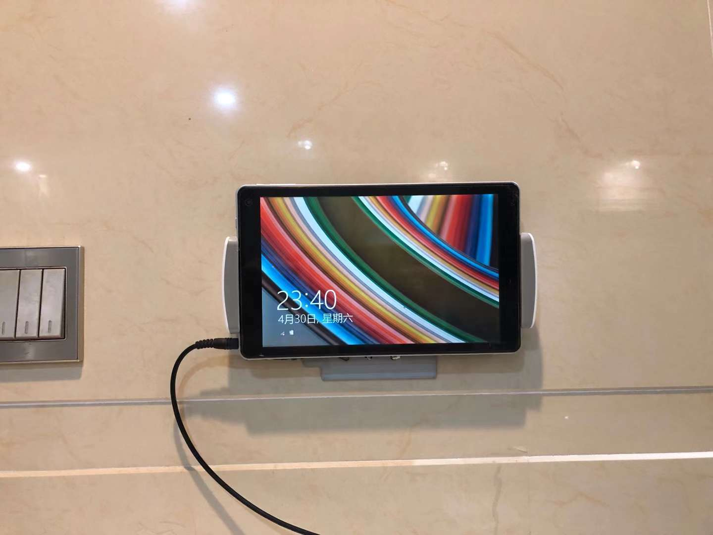

# 使平板电脑化身为时钟的 SDDM 主题

简体中文 | [English](README.md)

## 用户故事

稣有一个酷比魔方 iWork 8 Windows 8 平板，想让它作为时钟和下载器。



所以给它装了 Debian 11，然后做了这个主题。


把 XClock 跑在上面的效果：


## 安装

```sh
git clone https://github.com/UMU618/sddm-theme-clock
cd sddm-theme-clock
sudo ./install.sh
```

## 关于

本主题基于 [sddm-theme-maui](https://github.com/sddm/sddm)。
